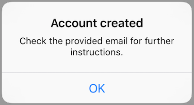
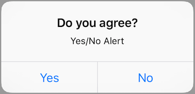

# MGAlertUtility

[](https://cocoapods.org/pods/MGAlertUtility)
[](https://opensource.org/licenses/MIT)

A simple utility class with static methods for presenting a UIAlertController.

### Examples


```objc
[MGAlertUtility showOkAlertWithMessage:@"Check the provided email for further instructions."
                                 title:@"Account created"
                              okAction:^(UIAlertController *alert, UIAlertAction *action) {
                                NSLog(@"User pressed %@", action.title);
                              }];
```


```objc
[MGAlertUtility showYesNoAlertWithMessage:@"What is this"
                                    title:@"idk"
                                   onView:self
                                 okAction:^(UIAlertController *alert, UIAlertAction *action) {
                                   NSLog(@"some action '%@'", action.title);
                                 }];
```


```objc
[MGAlertUtility showCancelActionSheet:@"Hello"
                              message:@"How are you?"
                              actions:@{
			      		@"Action 1" : ^(UIAlertController *alert, UIAlertAction *action) {
						NSLog(@"First Action: %@", action.title);
					}, 
					@"Action 2" : ^(UIAlertController *alert, UIAlertAction *action) {
						NSLog(@"Second Action: %@", action.title);
					}
			      }];
```

